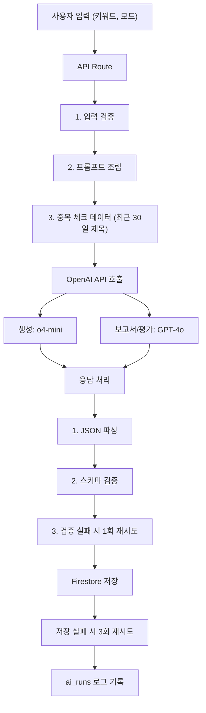

# AI Pipeline

> OpenAI API 호출 파이프라인의 흐름, 모델별 역할, 프롬프트 조립 규칙, 에러 처리, 비용 통제 전략을 정의한다.

---

## 1. 파이프라인 개요

---

## 2. 모델별 역할

| 용도 | 모델 | 예상 토큰 | 특성 |
|---|---|---|---|
| 아이디어 10개 생성 | ==o4-mini== | ~2K in + ~2K out | 빠르고 저렴. 창의적 생성에 적합 |
| Deep Report (PRD) | ==GPT-4o== | ~3K in + ~4K out | 구조화된 분석. 9개 섹션 보고서 |
| 비즈니스 평가 | ==GPT-4o== | ~3K in + ~3K out | 다각도 평가. 3중 구조 출력 |

---

## 3. 프롬프트 조립 규칙

### 아이디어 생성 시

1. ==시스템 프롬프트==: 생성 원칙 + 키워드 해석 규칙
2. 키워드 조합: 사용자 선택 키워드
3. 생성 모드 지시: Full Match / Forced Pairing 규칙
4. 중복 방지: 최근 30일 아이디어 제목 리스트
5. 출력 형식: ==JSON 응답 계약==

### 평가 시

1. ==시스템 프롬프트==: 평가 원칙 + 3중 출력 강제
2. 아이디어 PRD 전문
3. 평가 기준과 가중치
4. Few-shot 예시 (2개 이상)
5. 출력 형식: ==JSON 응답 계약==

---

## 4. 에러 처리

> [!warning]
> 검증 실패와 저장 실패는 ==재시도 횟수가 다르다== (검증 1회, 저장 3회).

| 실패 유형 | 처리 방식 |
|---|---|
| OpenAI API 타임아웃 | 1회 재시도 후 에러 반환 |
| JSON 파싱 실패 | 1회 same-input 재시도 후 `validation_status=failed` |
| 스키마 검증 실패 | 1회 same-input 재시도 후 `validation_status=failed` |
| Firestore 저장 실패 | 최대 3회 재시도 후 `save_status=failed` |
| Rate limit | 에러 메시지 사용자에게 전달, 재시도 안내 |

---

## 5. 비용 통제

> [!important]
> 월간 상한 ==$30==을 초과하면 경고를 표시한다.

- [[Database-Schema|ai_runs]] 컬렉션에 매 호출의 토큰 수를 기록
- 월간 누적 비용을 추적하여 상한 초과 시 경고
- 일일 발산 세션 기준 ==1회==, 추가 시 경고 표시
- Deep Report 생성 제한: ==주 5회==

---

## Related

- [[Backend-API]] — 파이프라인을 트리거하는 API 엔드포인트
- [[Database-Schema]] — ai_runs 컬렉션 및 저장 대상 스키마

## See Also

- [[Evaluation-Matrix]] — 평가 매트릭스 기능 명세 (03-Features)
- [[Generation-Modes]] — 발산 세션의 3가지 생성 모드 (03-Features)
