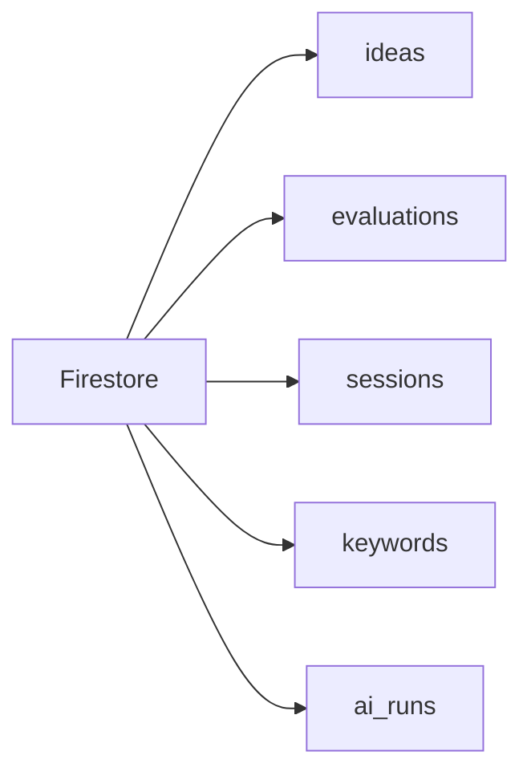

# Database Schema

> Firestore에 저장되는 5개 컬렉션(ideas, evaluations, sessions, keywords, ai_runs)의 필드 정의와 인덱스 설계를 정의한다.

---

## 1. Firestore 컬렉션 구조

---

## 2. ideas 컬렉션

> [!note]
> ==아이디어의 핵심 데이터==를 저장하는 메인 컬렉션이다.

| 필드명 | 타입 | 설명 |
|---|---|---|
| `id` | string | 문서 ID (자동 생성) |
| `title` | string | 아이디어 제목 |
| `summary` | string | 한 줄 요약 |
| `keywords_used` | string[] | 사용된 키워드 리스트 |
| `generation_mode` | string | `full_match` / `forced_pairing` / `serendipity` |
| `status` | string | `new` / `interested` / `reviewing` / `executing` / `on_hold` / `archived` |
| `bookmarked` | boolean | 북마크 여부 |
| `created_at` | timestamp | 생성일 |
| `last_reviewed` | timestamp | 마지막 상태 변경일 |
| `stale_flag` | boolean | 14일 방치로 자동 아카이브 시 true |
| `duplicate_warning` | boolean | 중복 의심 아이디어 경고 플래그 |
| `deep_report_id` | string | Deep Report 문서 ID (있을 경우) |
| `evaluation_id` | string | 평가 결과 문서 ID (있을 경우) |
| `total_score` | number | 종합 점수 (평가 완료 시) |
| `target_user` | string | 타겟 사용자 |
| `problem` | string | 핵심 문제 |
| `solution_hint` | string | 솔루션 힌트 |

---

## 3. evaluations 컬렉션

> [!important]
> 각 평가 항목은 ==3중 구조(reason, counterargument, verification_needed)==로 저장된다.

| 필드명 | 타입 | 설명 |
|---|---|---|
| `id` | string | 문서 ID |
| `idea_id` | string | 연결된 아이디어 ID |
| `market_score` | number | 시장성 점수 |
| `market_rationale` | map | `{ reason, counterargument, verification_needed }` |
| `build_score` | number | 실행 가능성 점수 |
| `build_rationale` | map | `{ reason, counterargument, verification_needed }` |
| `edge_score` | number | 독창성 점수 |
| `edge_rationale` | map | `{ reason, counterargument, verification_needed }` |
| `money_score` | number | 수익성 점수 |
| `money_rationale` | map | `{ reason, counterargument, verification_needed }` |
| `ethics_flag` | boolean | 윤리 리스크 플래그 |
| `ethics_note` | string | 윤리 리스크 상세 |
| `total_score` | number | 가중 합계 |
| `next_steps` | string[] | 점수 구간별 제안 액션 |
| `evaluated_at` | timestamp | 평가일 |

---

## 4. sessions 컬렉션

| 필드명 | 타입 | 설명 |
|---|---|---|
| `id` | string | 문서 ID |
| `session_date` | timestamp | 세션 날짜 |
| `session_type` | string | `diverge` / `converge` |
| `keywords_selected` | string[] | 선택한 키워드 |
| `generation_mode` | string | 사용한 생성 모드 |
| `ideas_generated` | number | 생성된 아이디어 수 |
| `ideas_bookmarked` | string[] | 북마크된 아이디어 ID |
| `ideas_discarded` | string[] | 비선택 아이디어 ID |
| `session_duration` | number | 소요 시간(초) |

---

## 5. keywords 컬렉션

| 필드명 | 타입 | 설명 |
|---|---|---|
| `id` | string | 문서 ID |
| `keyword` | string | 키워드명 |
| `category` | string | `who` / `domain` / `tech` / `value` / `money` |
| `source` | string | `fixed` / `custom` / `dynamic` |
| `added_at` | timestamp | 추가일 |
| `used_count` | number | 사용 횟수 |
| `last_used` | timestamp | 마지막 사용일 |

---

## 6. ai_runs 컬렉션

> [!tip]
> ==비용 추적과 디버깅==을 위해 모든 AI 호출의 실행 기록을 저장한다.

| 필드명 | 타입 | 설명 |
|---|---|---|
| `id` | string | 문서 ID |
| `run_type` | string | `idea_generation` / `deep_report` / `evaluation` |
| `prompt_version` | string | 프롬프트 버전 |
| `model` | string | 사용 모델명 |
| `input_tokens` | number | 입력 토큰 수 |
| `output_tokens` | number | 출력 토큰 수 |
| `latency_ms` | number | 응답 시간 |
| `validation_status` | string | `passed` / `failed` / `warning` |
| `save_status` | string | `pending` / `saved` / `failed` |
| `retry_count` | number | 재시도 횟수 |
| `error_message` | string | 실패 시 에러 메시지 |
| `created_at` | timestamp | 실행 시각 |

---

## 7. Firestore 인덱스

| 컬렉션 | 필드 조합 | 용도 |
|---|---|---|
| `ideas` | `status` + `created_at` (desc) | 상태별 최신순 목록 |
| `ideas` | `bookmarked` + `created_at` (desc) | 북마크 아이디어 조회 |
| `ideas` | `stale_flag` + `last_reviewed` | 방치 아이디어 감지 |
| `keywords` | `category` + `used_count` (asc) | Serendipity 추천용 |
| `sessions` | `session_date` (desc) | 최근 세션 조회 |

---

## Related

- [[Backend-API]] — 이 스키마를 읽고 쓰는 API 엔드포인트
- [[AI-Pipeline]] — ai_runs 컬렉션에 기록을 남기는 파이프라인

## See Also

- [[Evaluation-Matrix]] — evaluations 컬렉션의 점수 기준 (03-Features)
- [[Idea-Lifecycle]] — ideas 컬렉션의 status 전이 규칙 (03-Features)
