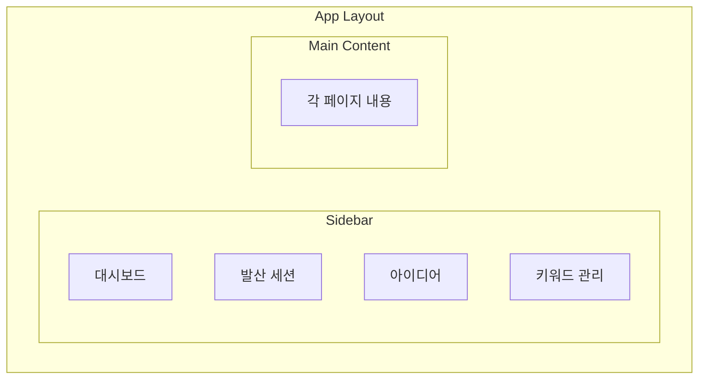

# Frontend Structure

> Next.js App Router 기반 프론트엔드의 페이지 라우팅, 레이아웃, 주요 컴포넌트, 상태 관리 전략을 정의한다.

---

## 1. 페이지 라우팅

| 경로 | 역할 | 주요 기능 |
|---|---|---|
| `/` | 대시보드 | 오늘의 추천 조합, 최근 활동, 북마크 요약 |
| `/generate` | 발산 세션 | 키워드 선택 → 생성 모드 선택 → 아이디어 10개 생성 → 북마크 |
| `/ideas` | 아이디어 목록 | Kanban 뷰 / 리스트 뷰, 필터, 검색, 상태 변경 |
| `/ideas/[id]` | 아이디어 상세 | Deep Report, 평가 결과, 상태 관리 |
| `/keywords` | 키워드 관리 | 키워드 풀 조회, 커스텀 키워드 추가/삭제, 사용 통계 |

---

## 2. 공통 레이아웃

> [!note]
> `layout.tsx`에서 Sidebar를 공통으로 렌더링하고, 각 페이지는 Main Content 영역에 표시된다.

---

## 3. 주요 컴포넌트

| 컴포넌트 | 위치 | 역할 |
|---|---|---|
| `KeywordPicker` | /generate | 카테고리별 키워드 선택 UI |
| `ModeSelector` | /generate | ==Full Match / Forced Pairing / Serendipity== 선택 |
| `IdeaCard` | /generate, /ideas | 아이디어 제목 + 요약 + 북마크 버튼 |
| `IdeaKanban` | /ideas | 상태별 Kanban 보드 |
| `IdeaList` | /ideas | 리스트 뷰 (필터/정렬) |
| `EvaluationView` | /ideas/[id] | 4개 항목 평가 결과 시각화 |
| `DeepReportView` | /ideas/[id] | PRD 내용 렌더링 |
| `KeywordTable` | /keywords | 키워드 풀 테이블 + CRUD |
| `SerendipityCard` | /, /generate | 오늘의 추천 조합 카드 |

---

## 4. 상태 관리

> [!tip]
> V1에서는 별도 상태 관리 라이브러리 없이 운영한다. V2에서 복잡도가 올라가면 ==Zustand== 등 도입을 검토한다.

- **서버 상태:** API 호출 → ==React Query 또는 SWR==로 캐싱
- **UI 상태:** React `useState` / `useReducer`로 로컬 관리
- **폼 상태:** 키워드 선택, 생성 모드 등은 컴포넌트 로컬 상태

---

## Related

- [[System-Architecture]] — 전체 시스템 구성도와 데이터 흐름
- [[Backend-API]] — 프론트엔드가 호출하는 API 엔드포인트 명세

## See Also

- [[Generation-Modes]] — 발산 세션의 3가지 생성 모드 (03-Features)
- [[Idea-Lifecycle]] — 아이디어 상태 흐름과 관리 (03-Features)
