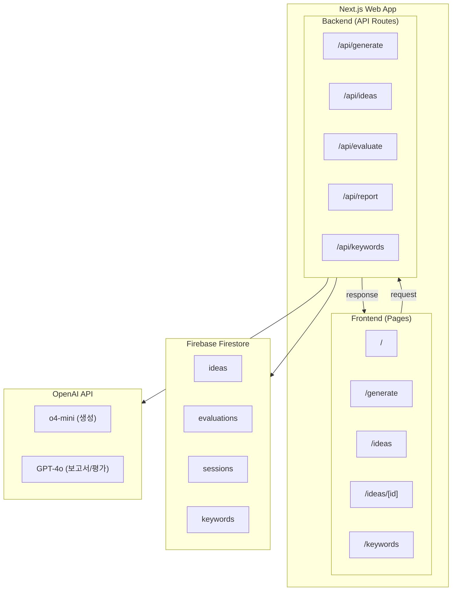
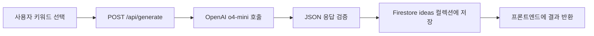
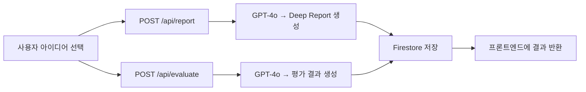

# System Architecture

> Idea Bank의 전체 시스템 구성, 데이터 흐름, 실패 처리 전략, 프로젝트 디렉토리 구조를 정의한다.

---

## 1. 전체 구성도



---

## 2. 데이터 흐름

### 발산 세션 (아이디어 생성)



### 수렴 세션 (평가)



---

## 3. 실행 경계와 실패 처리

> [!important]
> LLM 생성 성공 후 저장 실패가 나도 ==재생성하지 않고 같은 payload로 저장만 재시도==한다.

- 저장 재시도는 ==최대 3회==까지 수행하고, 이후에는 에러 상태로 기록한다.
- 평가 단계 실패는 아이디어 원본을 유지한 채 ==평가만 별도로 재실행==한다.
- 중복 경고는 생성 실패가 아니라 ==warning 상태==로 기록하고 사용자가 병합 여부를 선택한다.

---

## 4. 프로젝트 디렉토리 구조

```text
idea-bank/
├── src/
│   ├── app/                    ← 프론트엔드 (페이지)
│   │   ├── layout.tsx
│   │   ├── page.tsx            ← / 대시보드
│   │   ├── generate/page.tsx   ← /generate 발산 세션
│   │   ├── ideas/
│   │   │   ├── page.tsx        ← /ideas 목록
│   │   │   └── [id]/page.tsx   ← /ideas/[id] 상세
│   │   ├── keywords/page.tsx   ← /keywords 관리
│   │   └── api/                ← 백엔드 (API Routes)
│   │       ├── ideas/route.ts
│   │       ├── ideas/[id]/route.ts
│   │       ├── generate/route.ts
│   │       ├── evaluate/route.ts
│   │       ├── report/route.ts
│   │       └── keywords/route.ts
│   ├── lib/                    ← 공유 로직
│   │   ├── firebase.ts
│   │   ├── openai.ts
│   │   ├── prompts/
│   │   └── validators/
│   ├── components/             ← UI 컴포넌트
│   └── types/                  ← 공유 타입
├── docs/                       ← 기존 문서 (원본)
├── vault_ib/                   ← Vault 문서
└── .env.local                  ← API 키
```

---

## Related

- [[Frontend-Structure]] — 프론트엔드 페이지 라우팅과 컴포넌트 구조
- [[Backend-API]] — API 엔드포인트 명세와 에러 처리
- [[Database-Schema]] — Firestore 컬렉션 및 필드 정의

## See Also

- [[Project-Vision]] — 프로젝트 비전과 핵심 차별점 (01-Core)
- [[AI-Pipeline]] — AI 호출 파이프라인 상세 (02-Architecture)
