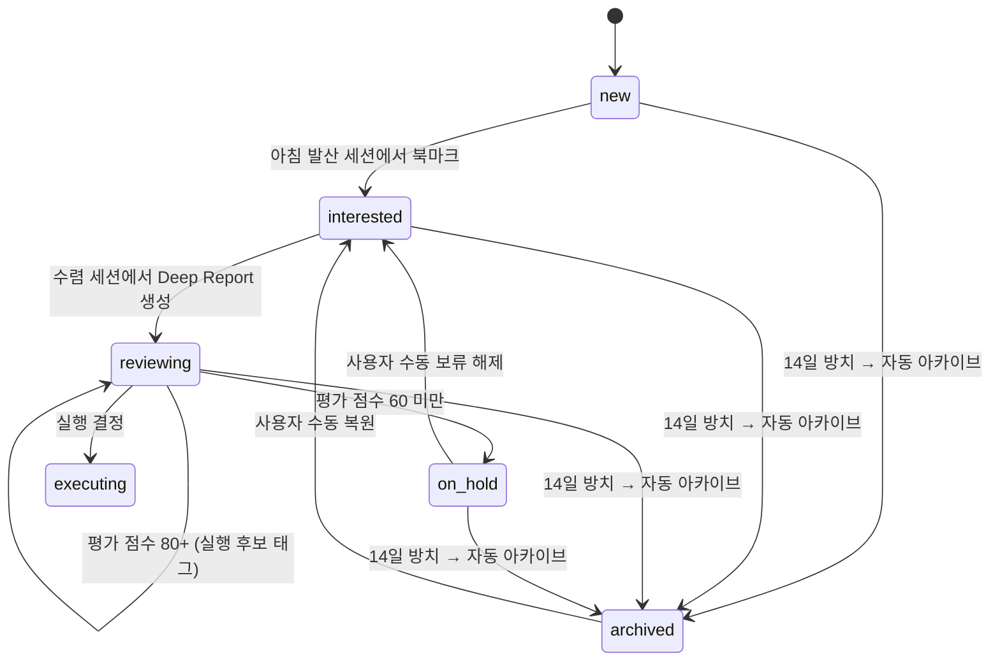

# Idea Lifecycle

> 아이디어의 ==Kanban 상태 관리==, 전이 규칙, 중복/방치 감지, 피드백 루프를 정의한다.

---

## 상태 관리 (Kanban)

### 상태 전이 규칙

| 트리거 | 전이 |
|--------|------|
| 아침 발산 세션에서 북마크 | `new` → `interested` |
| 수렴 세션에서 Deep Report 생성 | `interested` → `reviewing` |
| 평가 점수 80+ | `reviewing` 유지 + ==실행 후보 태그== |
| 평가 점수 60 미만 | → `on_hold` |
| ==14일 이상 상태 변화 없음== | → `archived` (자동) |
| 사용자가 수동으로 보류 해제 | `on_hold` → `interested` |
| 사용자가 아카이브에서 복원 | `archived` → `interested` |

## 중복 감지

### V1 (최소 구현)

- 아이디어 생성 시, 최근 30일 내 생성된 아이디어 제목 리스트를 프롬프트에 포함
- =="아래 아이디어는 이미 생성되었으므로 제외"== 지시

### 중복 감지 실패 시 처리

> [!important]
> 프롬프트에 제외 지시를 넣어도 중복이 생성될 수 있다. 이 경우:

- ==저장은 하되, 중복 경고를 표시==한다
- 아이디어에 `duplicate_warning: true` 플래그를 설정
- UI에서 경고 배지를 표시하여 사용자가 인지할 수 있게 함
- 사용자가 직접 판단하여 유지 또는 삭제 결정

### V2 (고도화)

- 아이디어 ==임베딩 기반 유사도 체크==
- 코사인 유사도 ==0.85 이상==인 기존 아이디어 존재 시 경고 표시

## 방치 감지 → 자동 아카이브

> [!important]
> 14일 이상 상태 변화가 없는 아이디어는 ==자동으로 `archived`로 이동==한다.

- **트리거:** `last_reviewed < (now - 14days)` AND `status != executing` AND `status != archived`
- **동작:** `status` → `archived`, `stale_flag` → `true`
- **실행 방식:** 사용자가 앱에 접속할 때 체크 (접속 시 트리거)
- **복원:** 사용자가 아카이브 목록에서 수동으로 `interested`로 복원 가능

> [!note]
> `executing` 상태의 아이디어는 방치 감지 대상에서 제외된다.

## 피드백 루프

선택/비선택 패턴은 세션 로그로 누적한다.

### V1

- 매 세션: ==선택 아이디어 ID, 비선택 아이디어 ID, 사용 키워드, 생성 모드, 날짜== 기록
- `sessions` 컬렉션에 자동 저장

### V2

> [!tip]
> 누적 로그를 분석하여 개인화된 추천을 제공한다.

- 누적 로그 분석으로 ==선호 도메인, 선호 수익 모델== 등 개인 프로파일 생성
- 추천 알고리즘에 반영

## Related

- [[Evaluation-Matrix]] — 평가 점수에 따른 상태 전이 조건
- [[Generation-Modes]] — 아이디어 생성 시 사용되는 모드
- [[Keyword-System]] — 피드백 루프에서 추적하는 키워드 사용 이력

## See Also

- [[Database-Schema]] — ideas, sessions 컬렉션 스키마 (02-Architecture)
- [[Session-Flow]] — 발산/수렴 세션의 전체 흐름 (05-Operations)
