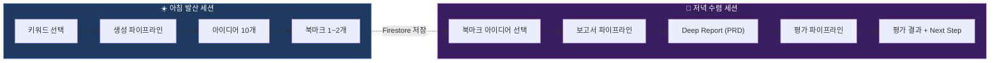
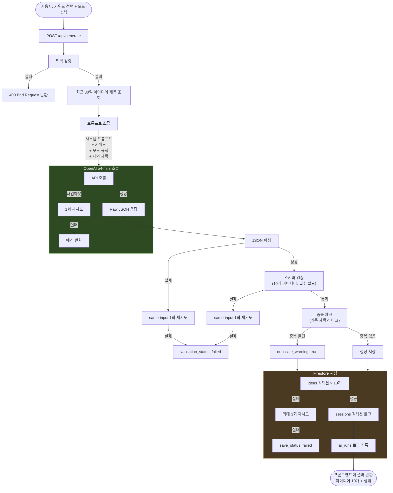
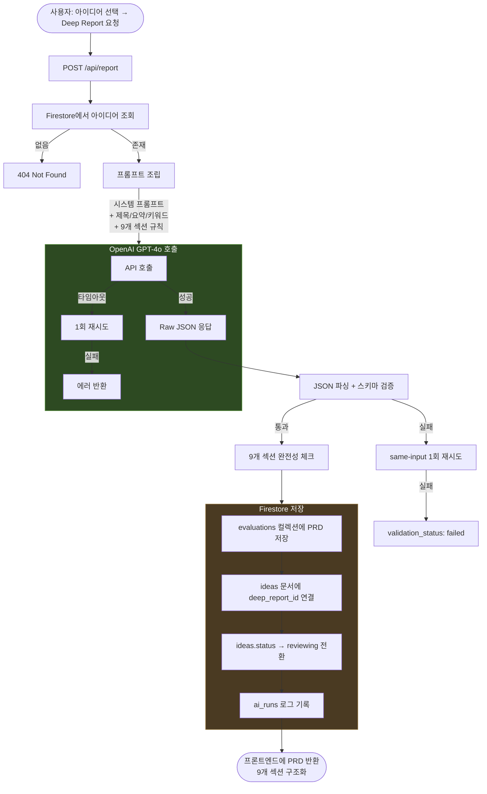
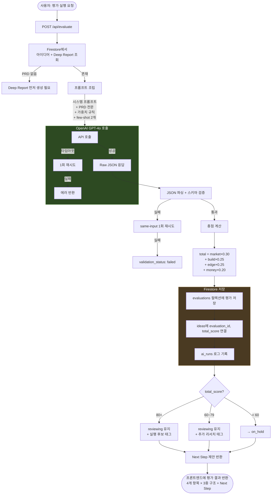
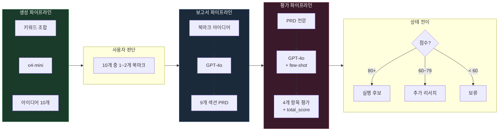
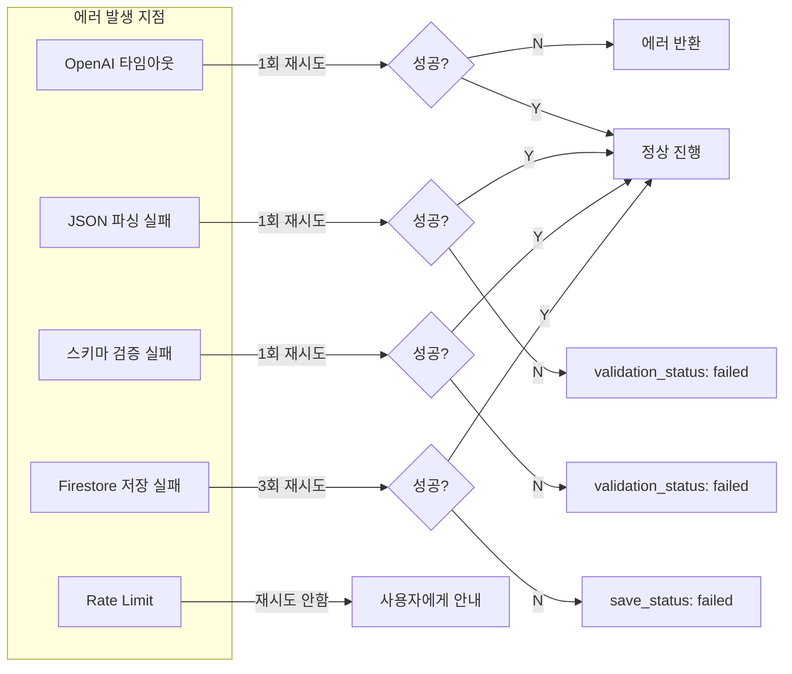
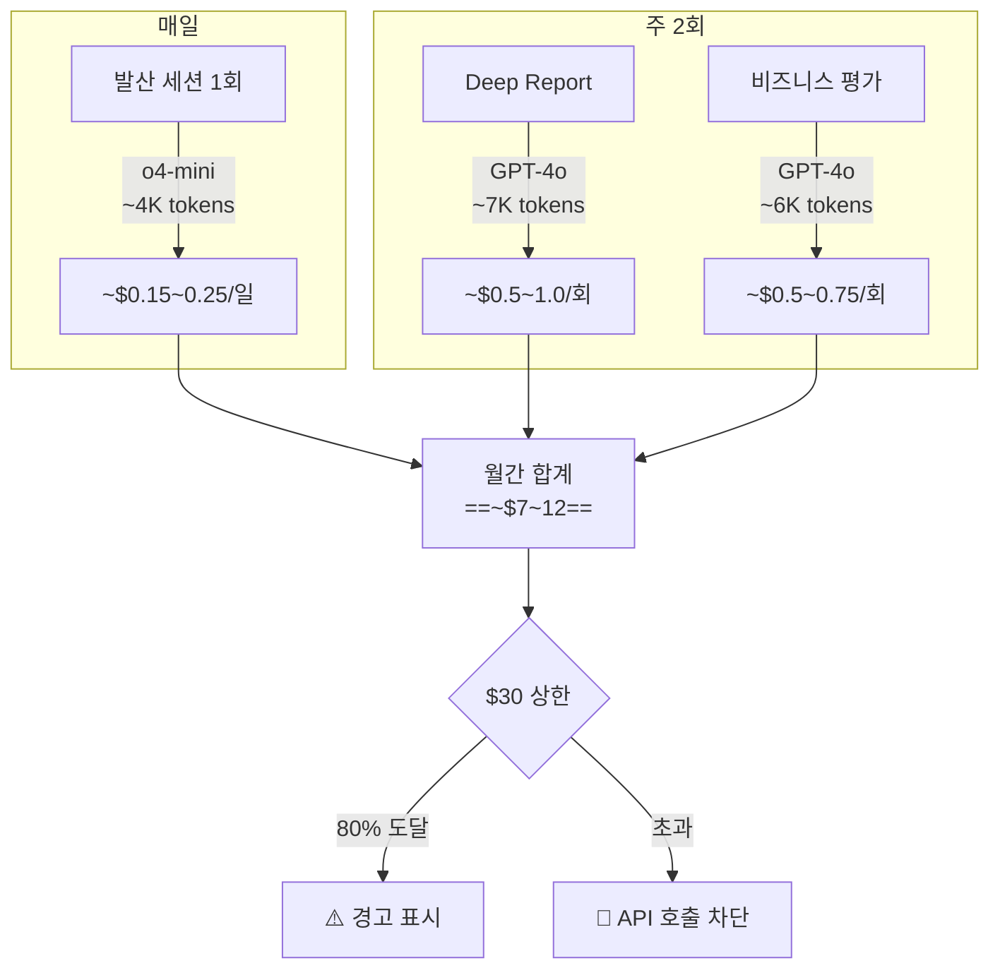

# AI Pipeline Diagrams

> Idea Bank의 3가지 AI 파이프라인(생성, Deep Report, 평가)의 전체 흐름을 시각화한다.

---

## 1. 전체 파이프라인 맵

사용자의 하루 세션에서 AI가 개입하는 3가지 지점:

---

## 2. 생성 파이프라인 (아이디어 생성)

> ==o4-mini== 사용 — 매일 아침 발산 세션

---

## 3. 보고서 파이프라인 (Deep Report)

> ==GPT-4o== 사용 — 저녁 수렴 세션

---

## 4. 평가 파이프라인 (비즈니스 평가)

> ==GPT-4o== 사용 — Deep Report 생성 직후

---

## 5. 파이프라인 간 데이터 흐름

아이디어 하나가 전체 파이프라인을 거치는 과정:

---

## 6. 에러 처리 요약

> [!important]
> 모든 에러는 ==ai_runs 컬렉션==에 기록된다. `error_message`, `retry_count`, `validation_status`, `save_status` 필드로 추적.

---

## 7. 비용 흐름

---

## Related

- [[Prompts-Overview]] — 프롬프트 설계 원칙과 버전 관리
- [[Response-Contracts]] — 각 파이프라인의 JSON 응답 계약
- [[Prompt-Generation]] — 생성 프롬프트 상세
- [[Prompt-Evaluation]] — 평가 프롬프트 상세 (few-shot 포함)

## See Also

- [[AI-Pipeline]] — 파이프라인 아키텍처 텍스트 문서 (02-Architecture)
- [[Idea-Lifecycle]] — 평가 결과에 따른 상태 전이 규칙 (03-Features)
